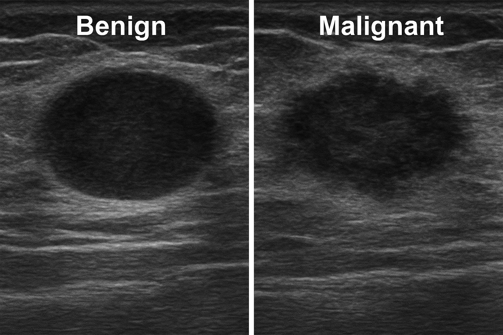

# Machine Learning Pipeline for Malignant Breast Cancer Cell Prediction

## Index

- [Project Overview](#project-overview)
- [Dataset](#dataset)
- [Workflow](#workflow)
- [Tools Used](#tools-used)

---

## Project Overview

This project applies a supervised machine learning pipeline to classify breast cancer tumors as **benign** or **malignant**, using clinical diagnostic features obtained from cell nuclei images.  The objective is to find the most effective model that aids in detecting tumors quickly and accurately, which will enhance decision-making in medical diagnostics.

---

## Dataset

The dataset used is the **Breast Cancer Wisconsin (Diagnostic)** dataset from the [UCI Machine Learning Repository](https://archive.ics.uci.edu/ml/datasets/breast+cancer+wisconsin+(diagnostic)).

> *Wolberg, W., Mangasarian, O., Street, N., & Street, W. (1993). Breast Cancer Wisconsin (Diagnostic) [Dataset]. UCI Machine Learning Repository. https://doi.org/10.24432/C5DW2B.*

Each row represents a tumor instance, with 30 numerical features derived from digitized images of a fine needle aspirate (FNA) of a breast mass.

- **Target variable**:  
  - `M` = Malignant  
  - `B` = Benign

- **Key features** include:  
  - Radius, Texture, Perimeter, Area, Smoothness, Compactness, Concavity, Concave Points, Symmetry, Fractal Dimension

---

## Workflow

1. **Data Acquisition & Preparation**
   - Dataset download
   - Cleaning and formatting

  > Initial dataset [breast_df.csv](data/breast_df.csv.csv)

2. **Exploratory Data Analysis (EDA)**
   - Class distribution
   - Feature density plots
   - Boxplots by diagnosis
   - Correlation heatmap
     
  > Plot images in [Plots folder](plots)

3. **Feature Engineering**
   - Split in Training (80%) and Test (20%) sets (`train_test_split`)
   - Standardization (`StandardScaler`)
   - Feature selection (`SelectKBest`, `RFE`)

  > Initial Training set [X_train](X_train)
  > Initial Test set [X_test](X_test)
  > Labels of Training set [Y_train](Y_train)
  > Labels of Test set [Y_test](Y_test)
  > Dataset Scaled  [X_train_scaled](X_train_scaled),[X_test_scaled](X_test_scaled)
  > Dataset with only the selected features [X_train_sel](X_train_sel), [X_test_sel](X_test_sel)
  > Labels of selected features Dataset [y_train_sel](y_train_sel), [y_test_sel](y_test_sel)

4. **Model Training & Evaluation**
   - Algorithms:
     - Logistic Regression
     - Linear Discriminant Analysis (LDA)
     - K-Nearest Neighbors (KNN)
     - Decision Tree
     - Naive Bayes
     - Support Vector Machine (SVM)

  > Models in [Models folder](models)

   - Evaluation metrics:
     - Accuracy
     - F1 Score
     - Precision & Recall
     - Confusion Matrix
     - MCC
     - ROC Curve & AUC

  > ROC Curve & AUC and COnfusion Matrix plots in [Plots folder](plots)

4. **Model Comparison**
   - Visual and tabular comparison of performance across models

> Final evaluation of model's performance [results_models](data/results_models)
---

## Tools Used

| Category         | Libraries                   |
|------------------|-----------------------------|
| **Data Handling**   | `pandas`, `numpy`             |
| **Visualization**   | `matplotlib`, `seaborn`       |
| **Modeling & Evaluation** | `scikit-learn`               |

---

## References

- [User Guide](https://scikit-learn.org/stable/user_guide.html) – Overview of preprocessing, pipelines, supervised/unsupervised models, and model selection.  
- [Getting Started](https://scikit-learn.org/stable/getting_started.html) – Quick intro to fitting, predicting, pipelines, and hyperparameter search.  
- [API Reference](https://scikit-learn.org/stable/api/index.html) – Complete list of classes and functions.

### Key modules used
- [Linear Models](https://scikit-learn.org/stable/modules/linear_model.html)  
- [Preprocessing](https://scikit-learn.org/stable/modules/preprocessing.html)  
- [Model Selection](https://scikit-learn.org/stable/modules/model_selection.html)  
- [Metrics](https://scikit-learn.org/stable/modules/model_evaluation.html)  
- [SVM](https://scikit-learn.org/stable/modules/svm.html)  
- [Naive Bayes](https://scikit-learn.org/stable/modules/naive_bayes.html)  
- [Decision Trees](https://scikit-learn.org/stable/modules/tree.html)  
- [Neighbors](https://scikit-learn.org/stable/modules/neighbors.html)  
- [Discriminant Analysis](https://scikit-learn.org/stable/modules/lda_qda.html)  
- [Feature Selection](https://scikit-learn.org/stable/modules/feature_selection.html)  

## AML basic Course materials
- Course repository with Slides and Notebook [Repository](https://drive.google.com/drive/folders/1ZrQpF_F9E45yQTO9mG8Izr3LaECVH0aH)

## Author 
Rossi Anna

Project for AML Baic Course of Bioinformatics Master's degree at Bologna University

anna.rossi18@studio.unibo.it

 

